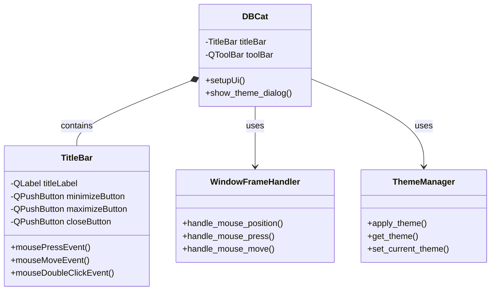
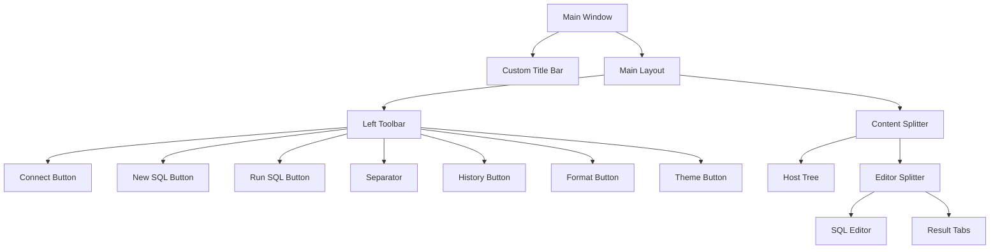

# Design Document: Modern UI Enhancements

## Overview

This design document outlines the implementation approach for modernizing the DBCat application's user interface. The enhancements focus on creating a custom window frame, removing the traditional menu bar, and adding theme customization directly to the toolbar. These changes will create a more streamlined, visually appealing interface while maintaining all existing functionality.

## Architecture

The UI enhancements will be implemented by modifying the existing PyQt5-based interface. The changes will primarily affect the main application window (`DBCat` class) and will introduce new components for the custom title bar. The implementation will follow these architectural principles:

1. **Separation of concerns**: UI components will be organized into separate classes with clear responsibilities
2. **Reusability**: Common UI elements will be designed for reuse across the application
3. **Maintainability**: Code will be well-documented and follow consistent patterns
4. **Backward compatibility**: All existing functionality will be preserved

## Components and Interfaces

### 1. Custom Title Bar Component

A new `TitleBar` class will be created to implement the custom window frame. This component will:

```python
class TitleBar(QtWidgets.QWidget):
    """Custom title bar with window controls"""
    
    def __init__(self, parent=None):
        super(TitleBar, self).__init__(parent)
        self.parent = parent
        self.setup_ui()
        
    def setup_ui(self):
        """Set up the title bar UI"""
        # Layout, title label, window controls
        
    def mousePressEvent(self, event):
        """Handle mouse press for window dragging"""
        
    def mouseMoveEvent(self, event):
        """Handle mouse move for window dragging"""
        
    def mouseDoubleClickEvent(self, event):
        """Handle double click for maximize/restore"""
```

### 2. Modified Main Window

The `DBCat` class will be modified to:
- Remove the menu bar
- Add the custom title bar
- Set the window to frameless mode
- Add theme switching to the toolbar

```python
class DBCat(QtWidgets.QMainWindow):
    """Main window with custom frame"""
    
    def __init__(self, parent=None):
        super(DBCat, self).__init__(parent)
        self.setWindowFlags(QtCore.Qt.FramelessWindowHint)  # Frameless window
        self.setupUi(self)
        
    def setupUi(self, DBcat):
        # Existing setup code
        
        # Add title bar
        self.title_bar = TitleBar(self)
        self.main_layout.insertWidget(0, self.title_bar)
        
        # Add theme button to toolbar
        self.add_theme_button_to_toolbar()
        
        # Remove menu bar
        self.menuBar().setVisible(False)
```

### 3. Window Resize Handling

To enable window resizing in frameless mode, we'll implement a window frame handler:

```python
class WindowFrameHandler:
    """Handles window resizing for frameless windows"""
    
    BORDER_WIDTH = 5  # Resize border width in pixels
    
    @staticmethod
    def handle_mouse_position(window, pos):
        """Determine cursor shape based on position"""
        # Logic to determine resize direction
        
    @staticmethod
    def handle_mouse_press(window, event):
        """Handle mouse press for resizing"""
        # Start resize operation
        
    @staticmethod
    def handle_mouse_move(window, event):
        """Handle mouse move for resizing"""
        # Perform resize operation
```

## Data Models

No new data models are required for this feature. We'll use the existing theme management system.

## UI Flow

1. **Application Start**:
   - Application initializes with frameless window
   - Custom title bar displays at the top
   - Toolbar shows on the left with theme button
   - No menu bar is displayed

2. **Window Control**:
   - User can drag the window by holding the title bar
   - Window control buttons (minimize, maximize, close) function as expected
   - Window borders allow resizing through mouse dragging

3. **Theme Switching**:
   - User clicks theme button in toolbar
   - Theme selection dialog appears
   - User selects a theme
   - Theme is applied immediately
   - Theme selection is saved for future sessions

## Error Handling

1. **Window Resizing Edge Cases**:
   - Handle minimum window size constraints
   - Prevent resizing beyond screen boundaries
   - Gracefully handle multi-monitor setups

2. **Theme Application Failures**:
   - Fallback to default theme if custom theme application fails
   - Log theme application errors
   - Provide user feedback for theme switching issues

## Testing Strategy

### Unit Tests

1. **TitleBar Component Tests**:
   - Test window control button functionality
   - Test window dragging behavior
   - Test maximize/restore toggle

2. **Theme Button Tests**:
   - Test theme dialog display
   - Test theme application
   - Test theme persistence

### Integration Tests

1. **Window Behavior Tests**:
   - Test window resizing from all edges and corners
   - Test window state persistence
   - Test interaction between title bar and window state

2. **UI Consistency Tests**:
   - Test all UI elements with different themes
   - Test UI element visibility and accessibility
   - Test toolbar functionality with custom frame

### Manual Testing

1. **Visual Inspection**:
   - Verify visual appearance across different themes
   - Check for alignment and spacing issues
   - Verify proper scaling on different screen resolutions

2. **Usability Testing**:
   - Verify all functionality remains accessible
   - Test keyboard shortcuts
   - Test window behavior on different platforms

## Implementation Plan

The implementation will follow these steps:

1. Create the `TitleBar` component
2. Modify the main window to use frameless mode
3. Implement window resize handling
4. Add theme button to toolbar
5. Remove menu bar and ensure all functionality is accessible
6. Test and refine the implementation

## Technical Considerations

### PyQt5 Specifics

- Use `Qt.FramelessWindowHint` for the custom window frame
- Implement mouse event handlers for window dragging and resizing
- Use `QSizeGrip` for corner resizing
- Ensure proper event propagation between components

### Theme Integration

- Ensure the custom title bar respects the current theme
- Apply theme colors to all custom components
- Test theme switching with the custom frame

### Cross-Platform Considerations

- Test on Windows to ensure consistent behavior
- Adjust resize border width based on platform
- Handle platform-specific window management quirks

## Diagrams

### Component Structure



### UI Layout



## Conclusion

This design provides a comprehensive approach to modernizing the DBCat user interface while maintaining all existing functionality. The implementation of a custom window frame, removal of the menu bar, and addition of theme switching to the toolbar will create a more streamlined and visually appealing application.